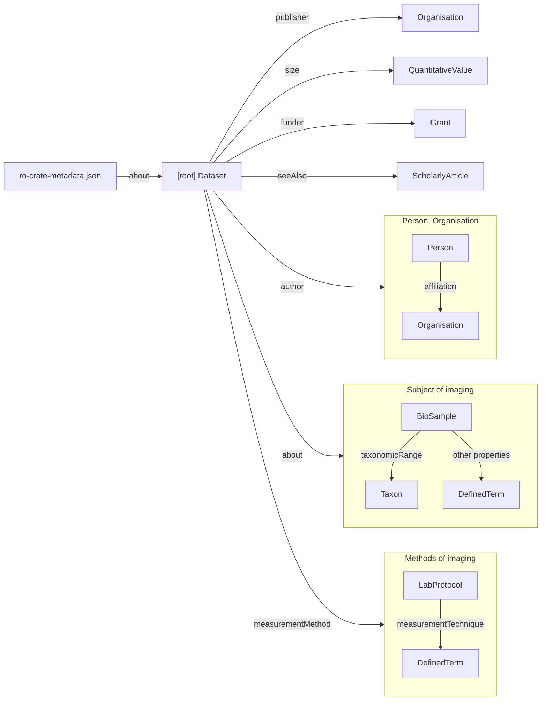

# GIDE search input ro-crate profile

January 2026

## ro-crate-metadata structure overview

As input, we expect a _detached RO-Crate_ consisiting solely of an ro-crate-metadata.json. This file _MUST_:

1. Generally abide by the requirements of a detatched ro-crate. At a high level this includes:
    - 1.1 Contain a self-describing RO-Crate Metadata Descriptor, with an @id of ro-crate-metadata.json, and a conformsTo of https://w3id.org/ro/crate/X where X equal to or greater than 1.2 (the version which defined detached ro-crates)
    - 1.2 Have a root dataset entity which the ro-crate-madatada.json describes (via the 'about' property).
2. The root dataset entity has an @id that is an absolute url to a page where the more information can be found about the entry and the data can be obtained.
3. Use the context term definitions in gide-search-context.jsonld. Additional terms _MAY_ be added, however, terms that are defined in this context _MUST NOT_ be changed to point at new IRIs.

### Expected objects

The @graph of the ro-crate-metadata _MUST_ include:

- Exactly one self-describing RO-Crate Metadata Descriptor.
- Exactly one root dataset entity of type _Dataset_, linked from the self-describing RO-Crate Metadata Descriptor via the _about_ property.
- One or more Taxon objects, of type _Taxon_, at least linked to the root dataset entity via the _about_ property.
- One or more Imaging Method objects, of type _DefinedTerm_, at least linked to the root dataset entity via the _measurementMethod_ property.
- One or more Authors, of type _Person_, linked to the root dataset entity via the _author_ property.
- Exactly one Publisher object, of type _Organisation_, linked to the root dataset entity via the _publisher_ property.

We _RECOMMEND_ including additional objects:
- Objects of type _Organisation_ to describe Author _affiliation_
- Further descriptions of the biological content that was captured in the images, with objects of type _BioSample_, and _DefinedTerm_.
- Further descriptions of the methods used to capture the images, with objects of type _LabProtocol_ and _DefinedTerm_.
- Descriptions of the methods used to analyse or annotation images
- Publications, of type _Publication_, which the dataset supported, or which provide additional detail on the methods used to create the dataset.

### Overview of graph between objects

Where a property can connect to a list of objects of different types, these have been grouped into a box. As an example, we require all relevant biological subjects of imaging to be referenced by the 'about' property of the dataset, but this does not preclude additional links between these objects (such as a BioSample's taxonomicRange also connecting to a Taxon listed in the 'about' of the dataset).

## Detailed Object schema

Property prefixes:
- rdf: http://www.w3.org/1999/02/22-rdf-syntax-ns#
- schema: http://schema.org/
- dwc: http://rs.tdwg.org/dwc/terms/
- dwciri: http://rs.tdwg.org/dwc/iri/
- bao: http://www.bioassayontology.org/bao#

Note that the requirements requirements below apply to both the json field names as well as the RDF graph that would be produced by a conversion to RDF using the context of the json-ld document.

### Dataset

| Field | Property | Requirement  | Cardinality | Description |
| --- | --- | :---: | --- | --- |
| @id | | REQUIRED | 1 | URL of the entry in its original database |
| @type | rdf:type | REQUIRED | 1+ | MUST include Dataset, but may include other types. |
| name | schema:name | REQUIRED | 1 | SHOULD identify the dataset to humans |
| description | schema:description | REQUIRED | 1 | SHOULD provide an overview of the dataset to summarising the context in which the dataset is important. |
| datePublished | schema:datePublished | REQUIRED | 1 | MUST be single string value in ISO 8601 date format. SHOULD be specified to the day.
| license | schema:license | REQUIRED | 1 | SHOULD be a URL to a licence description, e.g. |
| author | schema:author | REQUIRED | 1+ | MUST be _Persons_ or _Organsiations_ who contributed to the creation the dataset |
| publisher | schema:publisher | REQUIRED | 1 | MUST be a a single _Organisation_ that provides the data at URL of the @id of this entry. |
| about | schema:about | REQUIRED | 1+ | MUST contain all the information of on the biological matter relevant to this dataset. These MAY be _BioSamples_, _Taxons_, or _DefinedTerms_. |
| measurementMethod | dwciri:measurementMethod | REQUIRED | 1+ | MUST contain all the information of on the imaging techniques relevant to this dataset. These may be _LabProtocols_, or _DefinedTerms_. |
| thumbnailUrl | schema:thumbnailUrl | Recommended | 0+ | MUST be a list of URLs from which a thumbnail of an example image for the dataset can be obtained, for use in displaying example of the images. |
| identifier | schema:identifier | Recommended | 1 | MUST be a unique identifier used by the publisher of the dataset to refer to this dataset. |
| keywords | schema:keywords | optional | 0+ | Relevant keywords or tags used to describe the subject, methods, or contents of dataset. |  
| funder | schema:funder | optional | 0+ | The _Grants_ which funded the contributors or creation of this dataset.  |  
| seeAlso | rdf:seeAlso | optional | 0+ | The _ScholarlyArticles_ that were published alongside, or supported by, this Dataset. |  
| size | schema:size | optional | 0+ | _QuantitativeValues_ defining dimensions of the Dataset. Some dimensions are recommended (see the _QuantitativeValue_ section below) |  

### Person

| Field | Property | Requirement  | Cardinality | Description |
| --- | --- | :---: | --- | --- |
| @id | | REQUIRED | 1 | SHOULD be an ORCID id, otherwise a local identifier to the document |
| @type | rdf:type | REQUIRED | 1+ | MUST include Person, but may include other types. |
| name | schema:name | REQUIRED | 1 | SHOULD be the person's name for use in crediting authorship of the Dataset |
| affiliation | schema:affiliation | Recommended | 0+ | SHOULD be the _Organisations_ a person was a member of at the time of creating or publishing this dataset, that are related to the creation of this dataset. |
| email | email | optional | 1 | SHOULD be the email address to use to contact the Person about this Dataset |

### Organisation

Can appear through the property chains:

- Dataset - publisher ->  Organisation 
- Dataset - author -> Organisation
- Dataset - author -> Person - affiliation -> Organisation

| Field | Property | Requirement  | Cardinality | Description |
| --- | --- | :---: | --- | --- |
| @id | | REQUIRED | 1 | SHOULD be an RORID id, a URI, or otherwise a local identifier to the document. |
| @type | rdf:type | REQUIRED | 1+ | MUST include Organisation, but may include other types. |
| name | schema:name | REQUIRED | 1 | SHOULD be a an identifying name (or acryonym, if that is more commonly used) of the organisation. |
| url | schema:url | optional | 1 | SHOULD be a url to the main landing page of the organisation |
| address | schema:address | optional | 1 | MUST be the organisation's address. |

### DefinedTerm

Can found through the property chains:

- Dataset - about -> DefinedTerm
- Dataset - about -> BioSample - x -> DefinedTerm
- Dataset - measurementMethod -> DefinedTerm
- Dataset - measurementMethod -> LabProtocol - measurementTechnique -> DefinedTerm

where X can be a number of different relations (e.g. hasCellLine). If the connetion obj - X -> DefinedTerm is present, and Dataset - about | measurementMethod -> obj, then Dataset - about | measurementMethod -> DefinedTerm MUST also be included explicitly.

| Field | Property | Requirement  | Cardinality | Description |
| --- | --- | :---: | --- | --- |
| @id | | REQUIRED | 1 | MUST be an absolute URI to documentation about the term |
| @type | rdf:type | REQUIRED | 1+ | MUST include DefinedTerm, but may include other types. |
| name | schema:name | REQUIRED | 1 | SHOULD identify the term to humans, similar to an rdfs:label. |

### Taxon

Can be found through the property chains:

- Dataset - about -> Taxon
- Dataset - about -> BioSample - taxonomicRange -> Taxon

If the connetion BioSample - X -> Taxon is present, and Dataset - about -> BioSample, then Dataset - about -> Taxon MUST also be included explicitly.

| Field | Property | Requirement  | Cardinality | Description |
| --- | --- | :---: | --- | --- |
| @id | | REQUIRED | 1 | SHOULD be an NCBI taxonomy ID |
| @type | rdf:type | REQUIRED | 1+ | MUST include Taxon, but may include other types. |
| scientificName | dwc:scientificName | REQUIRED | 1 | MUST be the scientific name of the Taxon, following the relevant nomenclature code for the taxon. SHOULD be as complete as possible. |
| vernacularName | dwc:vernacularName | optional | 1 | SHOULD be a common or vernacular name of the Taxon. |

### BioSample

Please note that the BioSample type is a draft proposal to be added to schema.org, and thus http://schema.org/BioSample does not resolve. Details of the specification can be found at https://bioschemas.org/types/BioSample/0.2-DRAFT.

| Field | Property | Requirement  | Cardinality | Description |
| --- | --- | :---: | --- | --- |
| @id | | REQUIRED | 1 | CAN be a resolvable URL if one is available, but more likely it will be a local identifer within the document. |
| @type | rdf:type | REQUIRED | 1+ | MUST include BioSample, but may include other types. |
| name | schema:name | REQUIRED | 1 | SHOULD identify the main features of this biosample that distinguish it from others relevant to this dataset. |
| description | schema:description | REQUIRED | 1 | SHOULD provide details of the biosample, such as variables that were modified on a case-by-case basis. |
| taxonomicRange | schema:taxonomicRange | Recommended | 0+ | The _Taxons_ representing a classification of the  BioSample. |
| hasCellLine | bao:hasCellLine | optional | 0+ | The _DefinedTerm_ representing a classification of the BioSample. |

### LabProtocol

Please note that the LabProtocol type and labEquipment property are draft proposal to be added to schema.org, and thus http://schema.org/LabProtocol and http://schema.org/labEquipment do not resolve. Details of the specification can instead be found at https://bioschemas.org/profiles/LabProtocol/0.8-DRAFT. 

| Field | Property | Requirement  | Cardinality | Description |
| --- | --- | :---: | --- | --- |
| @id | | REQUIRED | 1 | CAN be a resolvable URL if one is available, but more likely it will be a local identifer within the document. |
| @type | rdf:type | REQUIRED | 1+ | MUST include LabProtocol, but may include other types. |
| name | schema:name | REQUIRED | 1 | SHOULD identify the protocol and distinguish it from others relevant to this dataset. |
| description | schema:description | REQUIRED | 1 | SHOULD provide details of the steps or settings involved in the protocol. |
| labEquipment | schema:labEquipment | Recommended | 0+ | SHOULD be a description of the equipment used in the capture of the image. |
| measurementTechnique | schema:description | Recommended | 0+ | SHOULD be a _DefinedTerm_ from the FBBI ontology if possible. |

### Grant

| Field | Property | Requirement  | Cardinality | Description |
| --- | --- | :---: | --- | --- |
| @id | | REQUIRED | 1 | SHOULD a resolvable id, such as a DOI, otherwise a local identifier to the document |
| @type | rdf:type | REQUIRED | 1+ | MUST include Organisation, but may include other types. |
| name | schema:name | REQUIRED | 1 | SHOULD be the name or title of the grant. |
| url | schema:url | optional | 1 | SHOULD be a link to a website where more information can be found about the grant. |

### ScholarlyArticle

| Field | Property | Requirement  | Cardinality | Description |
| --- | --- | :---: | --- | --- |
| @id | | REQUIRED | 1 | SHOULD be a resolvable id, such as a DOI, otherwise a local identifier to the document |
| @type | rdf:type | REQUIRED | 1+ | MUST include Organisation, but may include other types. |
| name | schema:name | REQUIRED | 1 | MUST be the title of the article as published. |
| datePublished | schema:datePublished | Recommended | 1 | MUST be single string value in ISO 8601 date format. |

### QuantitativeValue

We recommend providing two QuantitativeValues for a dataset to give an estimate of the quantity of data associated that can be retrieved from the publisher
- The number of files/images etc, stored by the publisher of the dataset. This MUST use the unitCode http://purl.obolibrary.org/obo/UO_0000189 (count) and the unitText "file count".
- The quantity of bytes of the total dataset, as recorded by the publisher (whether compressed or otherwise). This MUST use the unitCode http://purl.obolibrary.org/obo/UO_0000233 (bytes) and the unitText "bytes".

Additional QuantitativeValue may be included.

| Field | Property | Requirement  | Cardinality | Description |
| --- | --- | :---: | --- | --- |
| @id | | REQUIRED | 1 | SHOULD be a local identifier for the QuantitativeValue. |
| @type | rdf:type | REQUIRED | 1+ | MUST include QuantitativeValue, but may include other types. |
| value | schema:value | REQUIRED | 1 | SHOULD be number, using '.' to indicate a decimal point (rather than ','), and SHOULD avoid using either symbol as readability separators. |
| unitCode | schema:unitCode | REQUIRED | 1 | |
| unitText | schema:UnitText | REQUIRED | 1 | |
